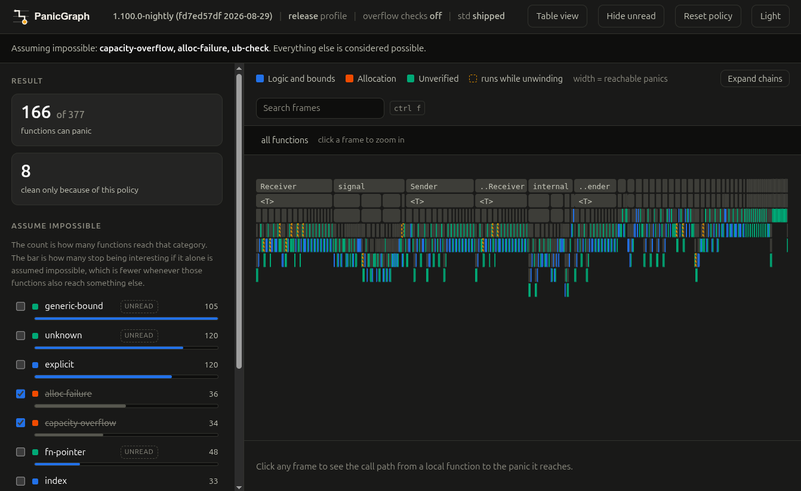

<div align="center">


# PanicGraph

[![Crates.io][crates-badge]][crates-url]
[![Documentation][doc-badge]][doc-url]
[![MIT or Apache-2.0 licensed][license-badge]][license-url]

[crates-badge]: https://img.shields.io/crates/v/panicgraph.svg?style=for-the-badge
[crates-url]: https://crates.io/crates/panicgraph
[doc-badge]: https://img.shields.io/docsrs/panicgraph?style=for-the-badge
[doc-url]: https://docs.rs/panicgraph
[license-badge]: https://img.shields.io/badge/license-MIT%20OR%20Apache--2.0-blue.svg?style=for-the-badge
[license-url]: https://github.com/fereidani/panicgraph#license



</div>

Reports which functions in a Rust crate can panic, why, and through what call
path. It reads the compiler's own view of the program, so the answer covers
the code you wrote and everything it calls, down into the standard library.

The problem with asking that question honestly is that the answer is "nearly
everything": every `Vec::push` can fail to allocate, so every function that
touches a growable collection is a panicking function. panicgraph's central
idea is that you can assume a category of panic impossible and have the whole
analysis re-run under that assumption, rather than filtering it out of a
finished report.

## Requirements

The analysis is a compiler driver, so it needs a nightly toolchain and the
compiler's own libraries:

```
rustup toolchain install nightly
rustup component add rustc-dev llvm-tools --toolchain nightly
```

The `+nightly` in the install line below selects that toolchain, and a
`rust-toolchain.toml` does the same if you build from a checkout instead. The
build stops with an explanation rather than a linker error when either piece
is missing.

## Install

```
cargo +nightly install panicgraph
```

That installs two binaries, `panicgraph` and `panicgraph-driver`. They live
next to each other and both are needed.

To work on panicgraph itself, build from a checkout instead, where
`rust-toolchain.toml` selects the toolchain for you:

```
cargo install --path .
```

### A smaller build for continuous integration

The interactive view and the drawing exist for a person looking at a result.
A build that only needs a verdict can leave them out:

```
# report and check only
cargo install panicgraph --version VERSION --no-default-features

# keep the drawing, or keep the view
cargo install panicgraph --version VERSION --no-default-features -F svg
cargo install panicgraph --version VERSION --no-default-features -F serve
```

`VERSION` stands for the release you want, which `cargo search panicgraph`
prints and `panicgraph --version` reports for a machine that already has one.
Use `--path .` in place of `panicgraph --version VERSION` to build the same
thing from a checkout.

Dropping both removes the compression dependency and the scripts the view is
built from, which is most of a megabyte of binary. `-l` and `--format svg`
are then rejected as unknown arguments rather than silently doing nothing.

## Getting started

Run it in a crate:

```
$ panicgraph
Analysis
    rustc              1.100.0-nightly (f7d782a3b 2026-08-19)
    profile            release (debug assertions off, overflow checks off)
    standard library   shipped
    suppressed         capacity-overflow, alloc-failure, ub-check
    functions          56 analysed, 10 can panic

divz
    defined at src/lib.rs:5:1
    divide-by-zero attempt to divide by zero at src/lib.rs:5:38

expect_res
    defined at src/lib.rs:3:1
    unwrap reached through a call
```

The header is part of the answer. Overflow checks do not exist in a build
that has them turned off, so a report that does not name its profile is not
saying anything definite.

## Assuming panics impossible

By default, allocation failure, capacity overflow, and standard library
precondition checks are assumed impossible. Turn that off and the picture
changes:

```
$ panicgraph --suppress ''
    suppressed         nothing
    functions          56 analysed, 12 can panic

push_vec
    defined at src/lib.rs:7:1
    capacity-overflow reached through a call
```

`push_vec` is a one line wrapper around `Vec::push`. With the default policy
it does not appear at all, because the only panic it reaches is one you asked
to assume away.

This is not a display filter. The assumption is applied before the analysis
propagates, so a function that panics only through a suppressed category is
genuinely clean, and so is everything above it. It also reaches into control
flow: a `Drop` that runs only while an allocation failure unwinds becomes
unreachable along with the failure itself.

Select categories by name or by group:

```
panicgraph --suppress foreign           # calls into C
panicgraph --suppress oom               # allocation only
panicgraph --suppress ''                # assume nothing
panicgraph --suppress all               # assume everything, which reports nothing
panicgraph --only unwrap,index          # report just these
panicgraph kinds                        # list the categories
```

## Explaining one function

```
$ panicgraph why unwrap_opt
unwrap_opt can panic with `unwrap`:

  unwrap_opt
      calls std::option::unwrap_failed at .../core/src/option.rs:1014:21
```

For a deeper path this prints each call in turn, marking the ones that run
only while an earlier panic is unwinding.

## Gating a build

`check` fails when a function that must not panic can. With no gate named, no
function in the crate may panic, which is the question an allocation free or
embedded crate asks:

```
$ panicgraph check --forbid '^(idx|divz)$'
2 functions must not panic and can:

divz
    at src/lib.rs:5:1
    divide-by-zero (must not panic)
idx
    at src/lib.rs:1:1
    index (must not panic)

Run `panicgraph why <function>` to see how one of them gets there.
$ echo $?
1
```

Patterns are regular expressions and may be repeated. `--allow` carves known
exceptions out of a broad rule, so the rule can stay broad:

```
panicgraph check --forbid '^api::' --allow '^api::legacy_'
```

Other gates. Naming any of them replaces the default rule rather than
stacking with it, so a ceiling means a ceiling:

```
panicgraph check --max 20               # fail above a ceiling
panicgraph check --fail-on-unknown      # refuse panics the analysis could not classify
```

### Ratcheting an existing crate

Most crates cannot go to zero today. Record what panics now, then fail only
on what is new:

```
panicgraph baseline panicgraph.json
panicgraph check --baseline panicgraph.json
```

A function absent from the record fails. So does one already recorded that
has gained a panic it did not have before, which a record of names alone
would miss. Functions that stop panicking are reported so the file can be
refreshed rather than drifting.

### In a workflow

```yaml
- uses: dtolnay/rust-toolchain@master
  with:
    toolchain: nightly-DATE
    components: rustc-dev, llvm-tools
- run: cargo install panicgraph --version VERSION --locked
- run: panicgraph check --baseline panicgraph.json --format github
```

`VERSION` and `DATE` are placeholders for values you write into the file: a
released version of this tool, and a nightly spelled `nightly-YYYY-MM-DD`.

Pin the version. A release can change what the analysis reads, so a function
no earlier version could explain may be reported by the next one, and a check
that passed yesterday fails today on code nobody touched. Naming `VERSION`
keeps a red build about the commit that caused it, and `--locked` does the
same for the tool's own dependencies.

Pin the toolchain for the same reason. The analysis reads MIR, so a newer
nightly changes which checks exist before panicgraph ever sees them, and the
driver links compiler internals that have no stable interface, so a floating
nightly can stop building altogether.

Upgrade either one deliberately, and write the record again in the same commit
with `panicgraph baseline panicgraph.json`, so the baseline and the tool that
reads it move together.

`--format github` writes workflow commands, so a failure lands on the line of
the function it is about instead of at the bottom of a log:

```
::error file=src/lib.rs,line=16,col=1,title=Function can panic::newly_added can panic with index (not in the baseline)
```

Exit codes are `0` for nothing to report, `1` for findings or a failed check,
and `2` when the tool could not complete.

## Looking at it

```
panicgraph -l 8080
```

Serves an interactive flame graph: assume categories impossible and watch what
survives, lock the view to a single category, search frames with `ctrl f` and
step through the matches, click a frame for the call path. A bare port binds
the loopback interface only; opening it more widely has to be asked for with
`-l 0.0.0.0:8080`, because it serves the source of the crate being analysed.

For something to attach to a report, write a standalone flame graph instead:

```
panicgraph --format svg > panics.svg
```

The file carries its own styling and behaviour, so it opens from disk with
nothing else present, and every frame keeps a title so it still explains
itself when scripting is off.

Clicking a frame zooms into it: the path it sits on stays in view as full
width bars and everything the frame does not contain goes, so what is left
is a picture of one path. `ctrl-F` searches the frames with a regular
expression, colours what matched, and says what share of the whole those
matches account for. `Reset Zoom` and `Reset Search` undo either. A search
is written into the address, so a picture opened at a finding can be handed
on as it stands. The policy the graph was drawn under is written under the
title, because a flame graph of what can panic says nothing definite without
the assumptions behind it.

Machine readable output is available everywhere with `--format json`.

## Checking findings against the compiled artifact

This is a may-panic analysis over MIR, and the optimizer sees further than
the folder does. `--verify` disassembles the libraries the analysis build
produced and follows each finding into the machine code:

```
verify_absent_loop
    index reached through a call (absent from the compiled artifact)
must_index
    index index out of bounds at src/lib.rs:10:5 (confirmed in the compiled artifact)
```

A confirmed finding still calls a panic entry point in the artifact. An
absent one was removed by the optimizer: every call the compiled function
makes was accounted for and none reaches a panic. Everything else is
unverified, which includes calls through registers, code the sweep cannot
see into, and categories that leave no symbol behind, such as a reference
count overflow's inlined trap. The verdict annotates the finding and never
removes it: absence from one artifact is a fact about that build, not a
proof about the source.

## Measuring precision over a corpus

`scripts/corpus.sh` runs the analysis over a list of crate directories and
prints one markdown table row per crate: functions analysed, findings, how
many findings carry only assumed categories, and the busiest categories.
Running it over crates whose panic freedom is proven externally turns every
non-assumed finding into a false positive to investigate, and keeping the
table in a log makes precision drift visible between toolchains and
releases.

## How it works

The analysis runs as a compiler driver invoked through `RUSTC_WRAPPER`, over
monomorphized MIR. Panic reasons come from the compiler's own `Assert`
terminators and from calls to panic entry points resolved by identity, not by
matching symbol names, which drift between releases.

Reachability is a fixpoint over the call graph: each function gets the set of
panic categories it can raise, unioned from everything it calls. Drop glue is
followed. Suppression removes categories before that propagation runs, and
cleanup paths are gated on the panic that unwinds into them.

Checks that are not in the build are not reported. The standard library ships
one copy of its MIR for every crate that uses it, so a body can carry an
overflow check or a precondition check that the crate being analysed compiles
away, and a check written against `size_of::<T>()` is still a branch there
even though it settles to a constant for every real `T`. Each body is folded
against the arguments it was reached with and the settings of the build in
front of it, the way codegen resolves them, so a branch neither can take is
not walked. A test carries into the arm it guards, so a division below
`if divisor != 0` raises nothing.

Folding reads across a call rather than stopping at one. A callee is walked
with what the call site knows about its arguments, so a value it returns
carries a range with it and a precondition it checks can be settled by the
caller that satisfies it: `left / right.max(1)` divides by something that
cannot be zero, and `v[i]` under `if v.len() >= 4` is in range for `i` below
four. What a structure holds travels the same way, into a call and back out
of one, so the size a `chunks_exact(4)` was built with is still four where
the iterator's own arithmetic reads it. A call is read for what it raises as
well as for what it returns: one whose every reachable block was found
unable to raise leaves nothing behind, and neither does the cleanup path
only a raise could have reached.

How long a slice is travels with it. An array unsized to a slice is as long
as its type says, a slice built from a pointer and a count is as long as the
count, and a guard that measures two lengths against each other settles the
check a copy between those two slices writes. An ordering against a length
survives the arithmetic done to it: `len - 1` and `at + 1` are still
measured against the same slice, `i.min(len - 1)` keeps the tighter of the
two bounds it was handed, and a value below one that is itself below a
length is below that length too.

Where two arms of a branch meet, what both leave behind survives as a range
instead of being given up, and a claim still moving after they have met is
pushed out to the nearest value the body compares against rather than
straight to the end of its type, so a counter a loop keeps below a constant
keeps that bound.

A claim belongs to the place it was read from rather than to whichever local
happened to hold it, so a guard on `self.pos` still stands at the next read
of that field, and a write to it, a call, or a pointer that could be aimed
at it takes the claim away again. A shared reference is not such a pointer,
since nothing is written through one, and neither is a pointer taken through
another: storing into `v[i]` cannot change how long `v` is. Values carry
what their own type says: a byte is an index every table of two hundred and
fifty six has room for, and a pointer taken of a place holds an address, so
the null check written under `NonNull::new` cannot fail. An enum carries
which variant it holds, which is what folds a `match` and what makes
`unwrap` of a value built as `Some` reach nothing at all; one written as a
niche has no tag of its own, so a value proved apart from the pattern that
stands for the empty variant is read as the variant that carries one.

The driver injects `-Zalways-encode-mir`. Without it, a dependency keeps MIR
only for generic and small items, so its concrete functions are opaque and
the panics inside them cannot be seen.

## Limitations

Read these before trusting a clean result.

- **The default standard library is partly opaque.** Concrete functions in
  `std` ship without MIR, so panics inside them are reported as `unknown`
  rather than proven absent. `--std full` rebuilds it from source with its
  bodies kept, which costs one build per toolchain: the tree is cached
  under the user's cache directory (`PANICGRAPH_CACHE` overrides where)
  and shared by every project on the machine. `check` and
  `baseline` do this by default, because a gate is read by its category
  names: with the shipped library a reachable `unwrap` reports as `unknown`.
  It does not remove `unknown`, it names it, so expect the same functions
  reported with sharper reasons.
- **`unknown` is not `clean`.** It means the analysis could not see inside
  something. `check --fail-on-unknown` refuses to treat the two alike.
- **Dynamic dispatch is not resolved, only named.** A `dyn Trait` call
  reports `dyn-call` and a function pointer call reports `fn-pointer`.
  `--candidates` expands both: every concrete implementation of the trait,
  and every reachable function reified to a pointer of a matching
  signature, joins the graph as a candidate edge, so the report shows what
  the call could actually do. The category stays either way, because
  candidates narrow the unknown rather than close it, and `--static-only`
  still drops the edges entirely. A call a generic function makes through
  one of its bounds reports `generic-bound`, since which implementation
  runs is the caller's choice. Each of these names where visibility ended;
  `--suppress assumed` assumes them all, and `check --fail-on-unknown`
  refuses them all.
- **This is a may-panic analysis.** A panic that is unreachable for reasons
  the compiler cannot see is still reported. It answers "could this panic",
  not "will it". Folding settles a check against constants, against what a
  branch above it proves, against what a type admits, against how long a
  slice is, and against what walking a callee shows it returns or cannot
  raise. A bound a guard re-establishes on every turn of a loop is followed;
  one that is only implied is not, and `i + 16 <= v.len()` says nothing
  about `v[i + 3]` in a build where the addition may wrap. An invariant held
  further out is still reported: one a caller establishes and the callee
  only assumes, and one a structure keeps across the methods that maintain
  it. A function that panics for some input
  is reported whatever its callers do, which is the honest answer for the
  function and the reason a caller that rules the input out is cleared
  separately.
- **The toolchain is pinned.** The driver links against compiler internals,
  which have no stable interface, so it is built for one nightly at a time.
  Updating the toolchain means reinstalling; the tool says so rather than
  leaving the loader to report a missing library.

## License

Copyright 2026 Khashayar Fereidani.

Licensed under either of [Apache License, Version 2.0](LICENSE-APACHE) or
[MIT license](LICENSE-MIT) at your option.

Unless you explicitly state otherwise, any contribution intentionally
submitted for inclusion in this crate by you, as defined in the Apache-2.0
license, shall be dual licensed as above, without any additional terms or
conditions.
